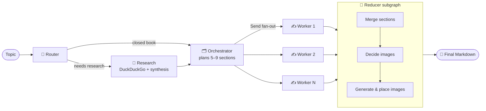

<div align="center">

# ✍️ BlogGraph

**An AI agent that researches, plans, writes and illustrates full technical blog posts, built with LangGraph.**

Type a topic. BlogGraph decides whether it needs fresh web research, plans an outline, writes every section in parallel, adds diagrams where they help, and gives you a finished Markdown blog.


</div>

---

## 📑 Table of contents

- [Features](#-features)
- [How it works](#-how-it-works)
- [Tech stack](#-tech-stack)
- [Project structure](#-project-structure)
- [Getting started](#-getting-started)
- [Configuration](#-configuration)
- [API reference](#-api-reference)
- [Deployment](#-deployment)
- [Learning path (notebooks)](#-learning-path-notebooks)
- [Security](#-security)
- [Troubleshooting](#-troubleshooting)

---

## ✨ Features

- 🧭 **Research routing.** A router picks one of three modes for each topic:
  - `closed_book` for evergreen topics, with no research
  - `hybrid` for evergreen topics that need current examples (last 45 days)
  - `open_book` for news, "latest", pricing or policy topics (last 7 days)
- 🔎 **Web research.** DuckDuckGo search results are condensed into a deduplicated evidence pack, filtered by date.
- 🗂️ **Planning.** An orchestrator turns the topic into 5–9 sections, each with a goal, bullet points, a word target and flags for research, citations and code.
- ⚡ **Parallel writing.** Each section goes to its own worker through LangGraph's `Send` API, and the finished sections are merged back in order.
- 📚 **Citations.** In research modes, claims link to the source URLs. The writer is told not to invent events it has no source for.
- 🖼️ **Diagrams.** An editor node picks up to 3 places where a diagram helps. The images are generated with FLUX.1 on Hugging Face and saved in the database.
- 🔑 **Bring your own key.** Each user enters their own Gemini key (and an optional HF token). Keys are used for that request only and never stored.
- 🛡️ **Handles free-tier limits.** Calls are paced per key and retried after rate-limit errors. If a model is overloaded or retired, the agent switches to another one.
- 👤 **Accounts.** Email/password sign-up (PBKDF2 hashes) or Google OAuth, with a saved history of your blogs.
- 📥 **Export.** Copy the finished blog or download it as a `.md` file.
- 🚀 **Easy to deploy.** A one-click Render Blueprint. Uses SQLite locally and PostgreSQL in production.

---

## 🧠 How it works



| Node | Role |
|---|---|
| **Router** | Picks the mode (`closed_book` / `hybrid` / `open_book`) and writes 3–10 search queries |
| **Research** | Runs the searches, has the LLM turn results into `EvidenceItem`s, removes duplicates and drops old items |
| **Orchestrator** | Writes a `Plan`: title, audience, tone, blog kind and a list of `Task`s |
| **Worker** ×N | Writes one section in Markdown, covering every bullet and citing sources where needed |
| **Reducer** | Merges the sections, picks spots for diagrams, generates them and inserts them |

Structured outputs are Pydantic models (`RouterDecision`, `Plan`, `EvidencePack`, `GlobalImagePlan`). The model gets the schema in its prompt, and the reply is validated. If validation fails, the error goes back to the model so it can fix its output.

---

## 🛠️ Tech stack

| Layer | Technology |
|---|---|
| Agent orchestration | [LangGraph](https://github.com/langchain-ai/langgraph), LangChain Core |
| LLM | Google Gemini (`gemini-flash-latest`) via `langchain-google-genai` |
| Image generation | Hugging Face Inference (`black-forest-labs/FLUX.1-schnell`) |
| Web search | DuckDuckGo (`langchain-community`) |
| Backend | FastAPI + Uvicorn |
| Database | SQLite (local) / PostgreSQL via `psycopg` (production) |
| Frontend | Vanilla HTML, CSS and JavaScript, served by FastAPI |
| Hosting | Render (Blueprint in `render.yaml`) |
| Observability | LangSmith tracing (optional) |

---

## 📁 Project structure

```text
blog_writing_agent/
├── bwa_backend.py                     # LangGraph agent: schemas, nodes, graph
├── api.py                             # FastAPI app: auth, generation, blogs, images, frontend
├── auth.py                            # Password hashing and session tokens (standard library only)
├── database.py                        # SQLite/PostgreSQL layer and maintenance CLI
├── frontend/
│   ├── index.html                     # Landing page, auth screens and workspace
│   ├── app.js                         # Client logic
│   └── style.css
├── 1_bwa_basic.ipynb                  # Notebook series: how the agent was built step by step
├── 2_bwa_improved_prompting.ipynb
├── 3_bwa_research.ipynb
├── 4_bwa_research_fine_tuned.ipynb
├── 5_bwa_image.ipynb
├── requirements.txt
├── render.yaml                        # Render Blueprint
├── DEPLOY.md                          # Step-by-step deployment guide
└── .env.example
```

---

## 🚀 Getting started

### Prerequisites

- Python **3.11+** (Render uses 3.13)
- A **Google Gemini API key**, free from [Google AI Studio](https://aistudio.google.com/apikey)
- *(Optional)* A **Hugging Face token** from [huggingface.co/settings/tokens](https://huggingface.co/settings/tokens), needed only for diagrams

### 1. Clone and install

```bash
git clone https://github.com/Sameerkc3579/BlogGraph.git
cd BlogGraph

python -m venv venv
# Windows
venv\Scripts\activate
# macOS / Linux
source venv/bin/activate

pip install -r requirements.txt
```

### 2. Configure

```bash
cp .env.example .env
```

The defaults are fine for local use. Leave `DATABASE_URL` empty and the app uses a local `bloggraph.db` SQLite file.

### 3. Run

```bash
python api.py
```

Open **http://127.0.0.1:8000**, create an account, paste your Gemini key into the **Configure** panel and enter a topic. A blog usually takes **1–3 minutes**.

> 💡 **Tip:** If you don't want to paste keys locally, put `GOOGLE_API_KEY` / `HF_TOKEN` in `.env` and set `ALLOW_SERVER_KEYS=1`. **Never do this on a public deployment.**

---

## ⚙️ Configuration

All settings are environment variables (see [`.env.example`](.env.example)).

| Variable | Default | Description |
|---|---|---|
| `DATABASE_URL` | *(empty)* | PostgreSQL connection string. If empty, SQLite is used. **Required on Render.** |
| `ALLOW_SERVER_KEYS` | `0` | `1` lets requests without keys use the server's `GOOGLE_API_KEY` / `HF_TOKEN`. For local use only. |
| `GOOGLE_API_KEY` / `HF_TOKEN` | *(empty)* | Server keys, used only when `ALLOW_SERVER_KEYS=1` |
| `GEMINI_MODEL` | `gemini-flash-latest` | Gemini model used by every node |
| `GEMINI_RPM` | `5` | Requests per minute per key. Set `0` to turn pacing off for paid keys. |
| `ENABLE_IMAGES` | `1` | `0` turns off diagram generation |
| `HF_IMAGE_MODEL` | `black-forest-labs/FLUX.1-schnell` | Text-to-image model |
| `DAILY_GENERATION_LIMIT` | `0` | Successful blogs per user per 24 h (`0` = unlimited) |
| `GOOGLE_CLIENT_ID` / `GOOGLE_CLIENT_SECRET` | *(empty)* | Turn on "Sign in with Google" |
| `APP_BASE_URL` | *(auto)* | Public base URL for the OAuth redirect |
| `ALLOWED_ORIGINS` | *(empty)* | Comma-separated CORS origins, needed only if another site calls the API |
| `SAVE_MARKDOWN_FILES` | `0` | `1` also writes each blog as a `.md` file in the project folder |
| `LANGCHAIN_TRACING_V2`, `LANGCHAIN_API_KEY`, `LANGCHAIN_PROJECT` | *(empty)* | Optional LangSmith tracing |

---

## 📡 API reference

Endpoints marked 🔒 need an `Authorization: Bearer <token>` header. Provider keys go in the `X-Google-Api-Key` and `X-HF-Token` headers.

| Method | Endpoint | Description |
|---|---|---|
| `GET` | `/health` | Health check |
| `POST` | `/auth/signup` | Create an account → `{ token, user }` |
| `POST` | `/auth/login` | Log in (`remember` gives a 30-day session) → `{ token, user }` |
| `POST` | `/auth/logout` | End the current session |
| `GET` | `/auth/google` | Start Google OAuth |
| `GET` | 🔒 `/auth/me` | Current user and usage info |
| `POST` | 🔒 `/generate` | Generate a blog: `{ "topic": "...", "as_of": "YYYY-MM-DD" }` |
| `POST` | 🔒 `/keys/check` | Check your keys without using any quota |
| `GET` | 🔒 `/blogs` | List your saved blogs |
| `DELETE` | 🔒 `/blogs/{id}` | Delete a blog and its images |
| `GET` | `/images/{filename}` | Serve a generated image |

Interactive docs are at **`/docs`** (Swagger UI) while the server is running.

<details>
<summary><b>Example: generate a blog with cURL</b></summary>

```bash
# 1. Sign up (or log in) to get a token
TOKEN=$(curl -s -X POST http://127.0.0.1:8000/auth/signup \
  -H "Content-Type: application/json" \
  -d '{"name":"Alex","email":"alex@example.com","password":"supersecret"}' | jq -r .token)

# 2. Generate
curl -X POST http://127.0.0.1:8000/generate \
  -H "Authorization: Bearer $TOKEN" \
  -H "X-Google-Api-Key: $GOOGLE_API_KEY" \
  -H "Content-Type: application/json" \
  -d '{"topic":"How LangGraph enables multi-agent workflows in production"}'
```

The response contains `markdown`, `blog_title`, `mode`, `sections_count` and the saved `blog` record.
</details>

---

## ☁️ Deployment

BlogGraph deploys to **Render** from the included Blueprint:

1. Create a PostgreSQL database. [Neon](https://neon.tech) has a free tier.
2. In Render, choose **New → Blueprint** and select this repo.
3. Set `DATABASE_URL` when Render asks for it, then deploy.

Don't put AI keys on the server; users bring their own. The full guide is in **[DEPLOY.md](DEPLOY.md)**.

---

## 📓 Learning path (notebooks)

The notebooks show how the agent was built, one step at a time:

| # | Notebook | What it adds |
|---|---|---|
| 1 | [`1_bwa_basic.ipynb`](1_bwa_basic.ipynb) | Basic orchestrator → workers → reducer graph |
| 2 | [`2_bwa_improved_prompting.ipynb`](2_bwa_improved_prompting.ipynb) | Better prompts and structured plans |
| 3 | [`3_bwa_research.ipynb`](3_bwa_research.ipynb) | Router and web research node |
| 4 | [`4_bwa_research_fine_tuned.ipynb`](4_bwa_research_fine_tuned.ipynb) | Recency windows, grounding and citations |
| 5 | [`5_bwa_image.ipynb`](5_bwa_image.ipynb) | Reducer subgraph with image planning and generation |

---

## 🔐 Security

- **Keys are never stored.** Provider keys come in request headers and travel in the LangGraph `config`, not the graph state. They are wrapped in a `repr=False` dataclass so they stay out of logs and traces, and they are removed from error messages.
- **Passwords** are hashed with PBKDF2-SHA256 (240k iterations) and compared in constant time. Logins for unknown emails run a dummy hash so response times don't reveal which emails exist.
- **Sessions** use random tokens. The database stores only their SHA-256 hash.
- **Failed logins are throttled** per email and per IP address.
- **One generation at a time** per account.
- **Image URLs** include a random suffix, so they can't be guessed.

---

## 🩺 Troubleshooting

| Symptom | Fix |
|---|---|
| *"Your Gemini API key kept hitting Google's per-minute limit"* | Free keys allow only a few requests per minute, and one blog makes about 7–11 calls. Wait a minute and try again. |
| *"used its daily free quota"* | The quota resets the next day. You can also enable billing in Google AI Studio. |
| *"servers are overloaded (high demand)"* | This is on Google's side and temporary. The agent already retries and switches models, so try again in a few minutes. |
| `NOT_FOUND` for a model | Keep `GEMINI_MODEL=gemini-flash-latest`. Pinned model versions get retired for new keys. |
| Blog has no images | Add a Hugging Face token and check that `ENABLE_IMAGES=1`. Also check your HF credits. |
| App won't start on Render | `DATABASE_URL` is missing. Render wipes the disk, so PostgreSQL is required. |
| First request on Render is slow | Free Render instances sleep when idle, so the first request after a pause can take up to a minute. |

---

<div align="center">

Built with ❤️ using **LangGraph** · If you find this useful, please ⭐ the repo!

</div>
